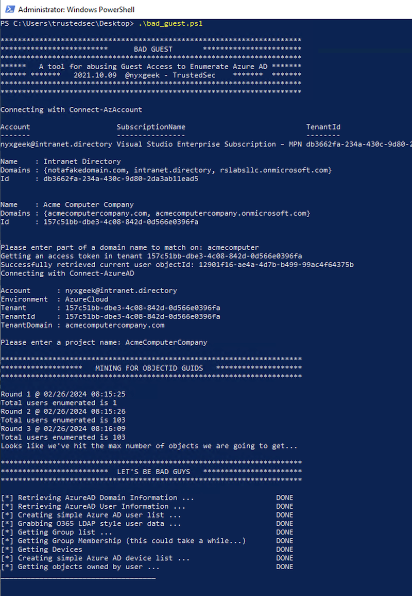

bad guest

By default, Microsoft tries to restrict the ability for Guest users to retrieve user and group informaiton.

The Azure Portal and Microsoft Entra, Microsoft Graph, and the Azure PowerShell commandlets all block access to attempts to retrieve user lists.

Bad Guest shows a loophole, where if a Guest user is added to ANY group in the organization, they can proceed to retrieve user lists and group lists.

blog post:

https://trustedsec.com/blog/unwelcome-guest-abusing-azure-guest-access-to-dump-users-groups-and-more

